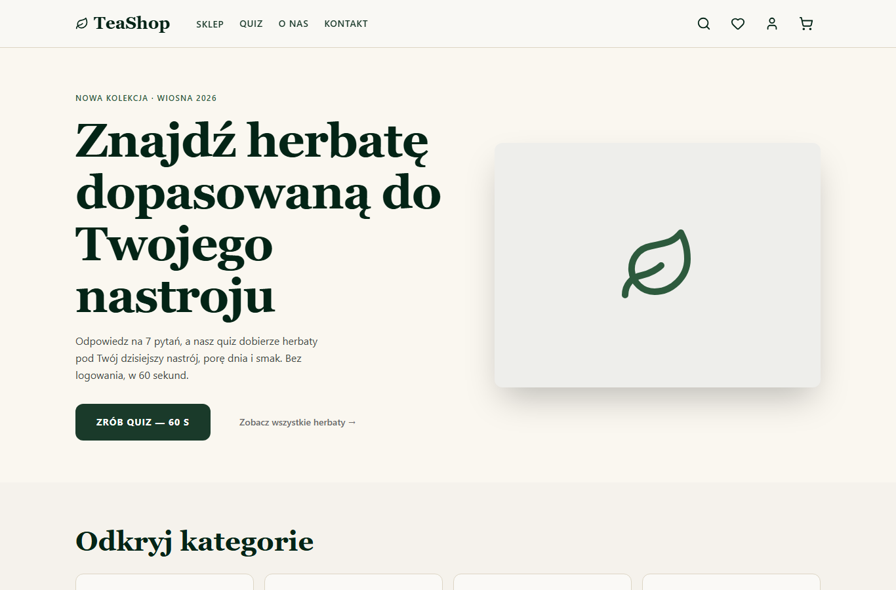
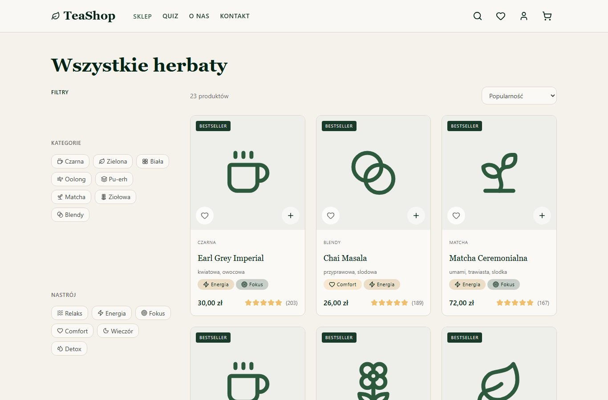
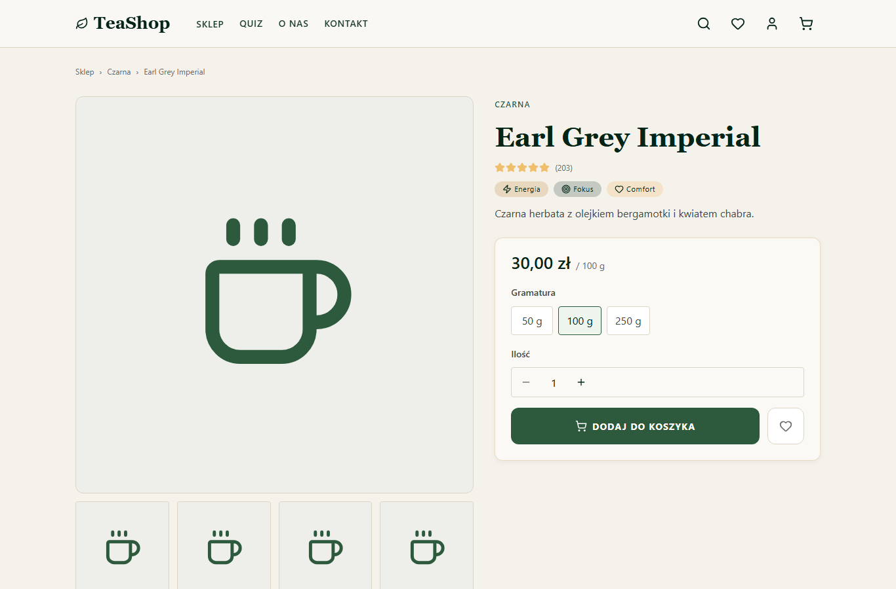
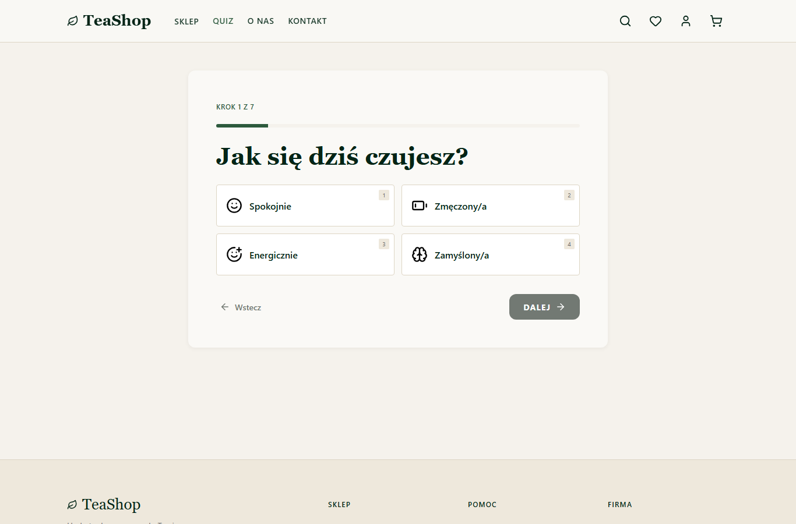
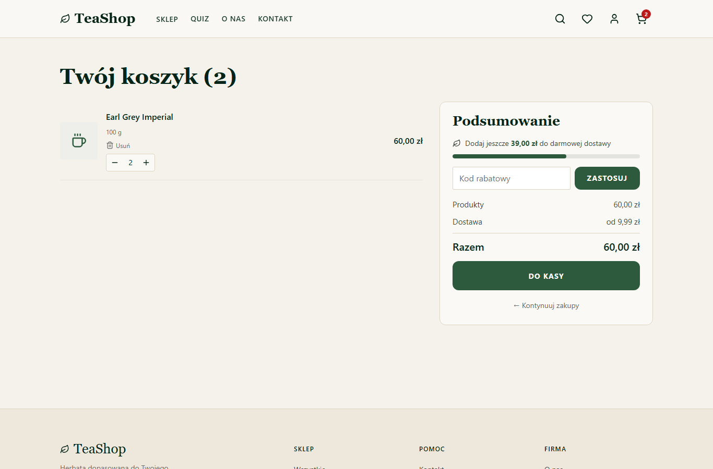
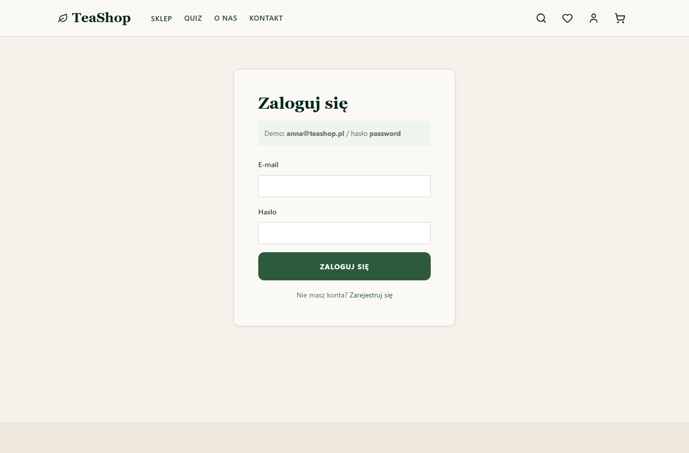
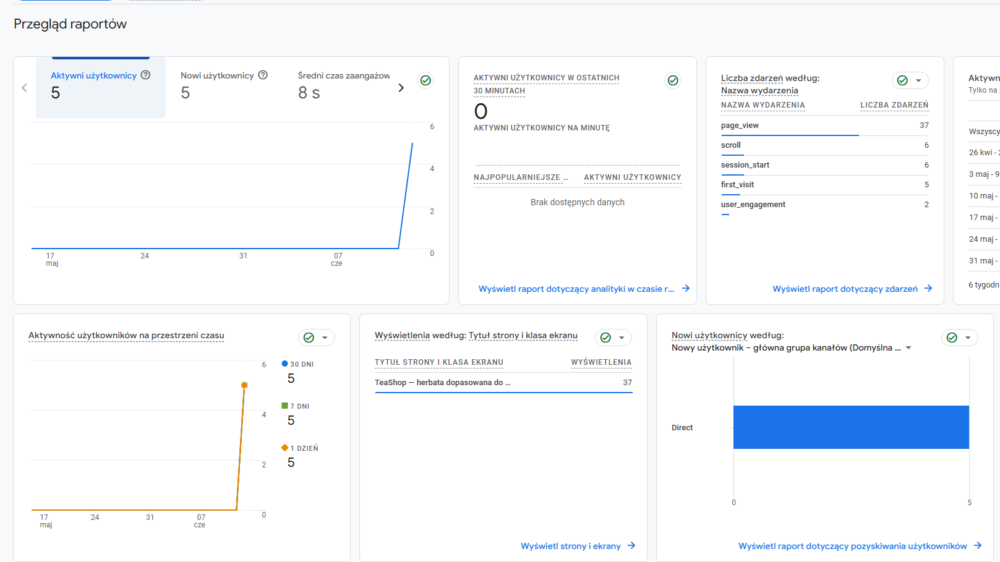
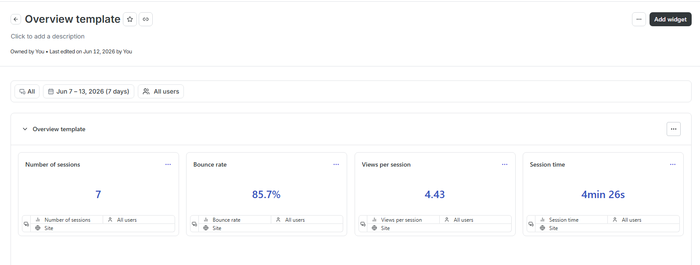

# 🍵 TeaShop

Sklep internetowy z herbatą, którego wyróżnikiem jest **quiz nastrojowy** — 7 pytań kafelkowych dopasowujących herbaty do aktualnego samopoczucia użytkownika. Aplikacja obejmuje pełną ścieżkę zakupową: katalog z filtrami, kartę produktu, koszyk z kodami rabatowymi i trzyetapowy checkout dostępny bez zakładania konta.

Projekt realizowany w ramach przedmiotu **TPF**.

🎨 Makieta: [Figma — TeaShop](https://www.figma.com/design/Cm5mXknRWG9UCxqU7OD0AB/TeaShop?node-id=0-1)

---

## Funkcjonalności

- **Strona główna** — hero z CTA do quizu, kafelki 8 kategorii, bestsellery, nowości
- **Sklep** (`/sklep`, `/sklep/:kategoria`) — listing z filtrami (kategoria, nastrój, smak, kofeina, cena, ocena), sortowaniem i paginacją
- **Karta produktu** (`/produkt/:slug`) — galeria, znaczniki nastroju, sekcja parzenia, wybór gramatury, recenzje, sekcja „Pasuje do"
- **Quiz nastrojowy** (`/quiz`) — 7 pytań → rekomendacje z procentem dopasowania i fallbackiem na bestsellery; wynik trwały między sesjami
- **Koszyk** — panel boczny (drawer) + pełna strona, kody rabatowe, pasek darmowej dostawy od 99 zł
- **Checkout** (`/zamowienie`) — 3 kroki: dane dostawy → wybór dostawy → podsumowanie; guest checkout
- **Konto** — logowanie, rejestracja, profil (trasa chroniona — bez sesji przekierowuje na `/logowanie`), ulubione
- **Wyszukiwarka** — pełnoekranowa nakładka przeszukująca nazwy, pochodzenie, kategorie i tagi
- **404** — fallback dla nieistniejących ścieżek

## Stack technologiczny

| Warstwa | Technologia |
|---|---|
| Build | Vite + React 19 + TypeScript (strict) |
| Routing | React Router v7 (`createBrowserRouter`, layout `RootLayout`, trasa chroniona) |
| Stan serwerowy | TanStack Query |
| Stan kliencki | Zustand (koszyk, ulubione, quiz, sesja) lustrzany do `localStorage` |
| Formularze | React Hook Form + Zod |
| Stylowanie | CSS Modules + design tokens (`src/styles/tokens.css`) |
| Analityka | Google Analytics 4 (`react-ga4`) + Hotjar (`@hotjar/browser`) |
| Testy | Vitest + React Testing Library, Playwright (e2e) |
| Mock API | In-browser mock o kontrakcie docelowego API .NET (`src/mocks/`) |

Struktura: widoki w `web/src/pages/` (po jednym folderze na ekran), komponenty reużywalne w `web/src/components/` (Button, Badge, ProductCard, TextField, Rating, Skeleton…), logika feature'ów w `web/src/features/`.

## Uruchomienie

```bash
cd web
npm install
npm run dev          # http://localhost:5173
```

Aplikacja działa standalone — żądania HTTP obsługuje mock w przeglądarce (`VITE_USE_MOCK=true` w `.env.development`), z symulowanym opóźnieniem 150–400 ms. Logowanie: e-mail dowolnego użytkownika z `src/mocks/data.ts` + hasło `password`.

Pozostałe skrypty:

```bash
npm run build        # produkcyjny build (tsc + vite)
npm run test         # testy jednostkowe (vitest)
npm run lint         # eslint
npm run typecheck    # tsc --noEmit
```

## Analityka — konfiguracja

Identyfikatory podaje się przez zmienne środowiskowe (puste lokalnie → analityka wyłączona, brak szumu w danych):

```env
VITE_GA_MEASUREMENT_ID=G-00H34TCJ64
VITE_HOTJAR_SITE_HASH=7419e02c3fcd7
```

- Inicjalizacja obu narzędzi: `web/src/lib/analytics.ts`, wywoływana z `App.tsx`
- Pageview przy każdej zmianie trasy SPA: `web/src/app/AnalyticsListener.tsx` (renderowany w `RootLayout`, bo `useLocation` wymaga kontekstu routera)

## Screeny aplikacji

### Strona główna


### Sklep — listing z filtrami


### Karta produktu


### Quiz nastrojowy


### Koszyk


### Logowanie (oraz cel przekierowania z chronionej trasy `/profil`)


## Wyniki z Google Analytics



## Wyniki z Hotjar



## Dokumentacja projektowa

| Dokument | Zakres |
|---|---|
| `TeaShop_architektura_informacji_Version1/2.md` | Sitemap, nawigacja, taksonomia, wireframe'y |
| `TeaShop_diagram_funkcjonalnosci_Version1.md` | Mapa modułów i zakres MVP/v2 |
| `TeaShop_slownik_funkcji_Version1.md` | Kryteria akceptacji per funkcja (ID typu `Q-05`) |
| `TeaShop_schemat_powiazan_Version1.md` | Diagram ER → kształt danych i endpointy |
| `design.md` | Kontrakt wizualny: tokeny, typografia, layouty |
| `plan.md` | Plan wdrożenia etapami |
