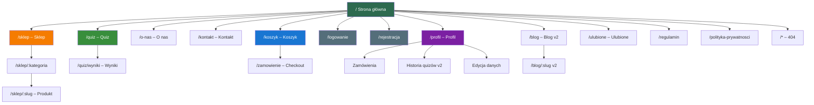
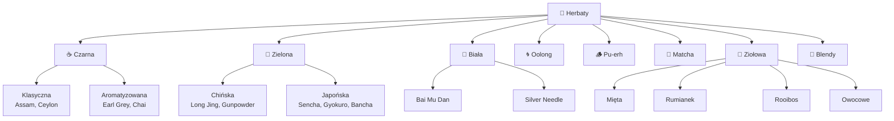
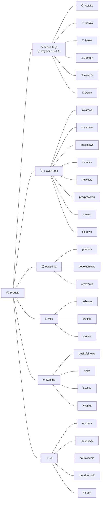
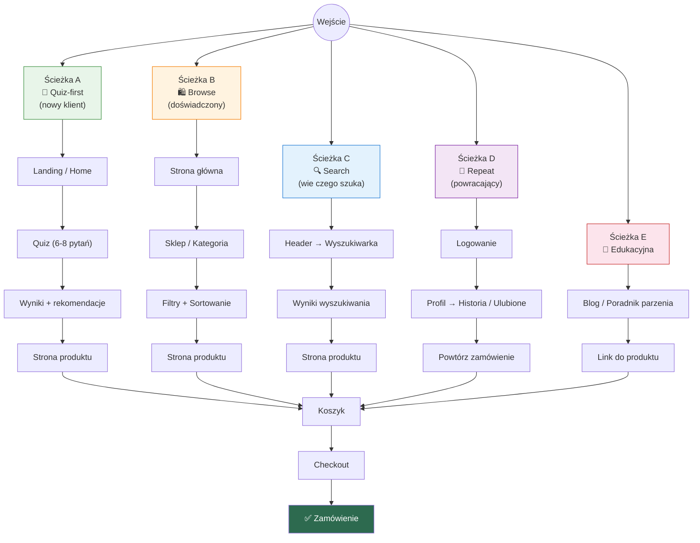

# 🍵 TeaShop – Architektura Informacji

---

## 1. Mapa strony (sitemap)



---

## 2. Hierarchia nawigacji

### 2.1 Header (sticky, wszystkie strony)

```
┌──────────────────────────────────────────────────────────────┐
│  🍵 Logo    Sklep ▾   Quiz   O nas   Blog     🔍  👤  🛒(3) │
│              ├─ Czarna                                       │
│              ├─ Zielona                                      │
│              ├─ Biała                                        │
│              ├─ Oolong                                       │
│              ├─ Ziołowa                                      │
│              ├─ Matcha                                       │
│              ├─ Pu-erh                                       │
│              ├─ Blendy                                       │
│              └─ Wszystkie                                    │
└──────────────────────────────────────────────────────────────┘
```

### 2.2 Mobile (hamburger)

```
┌─────────────────┐
│  🍵 Logo   🔍 🛒 │
│  ☰                │
│  ├─ Sklep         │
│  │  ├─ Czarna     │
│  │  ├─ Zielona    │
│  │  ├─ ...        │
│  ├─ Quiz          │
│  ├─ O nas         │
│  ├─ Blog          │
│  ├─ Kontakt       │
│  ├─ ────────────  │
│  ├─ 👤 Profil     │
│  ├─ 📦 Zamówienia │
│  ├─ ❤️ Ulubione   │
│  └─ 🚪 Wyloguj   │
└───────────────────┘
```

### 2.3 Footer

```
┌─────────────────────────────────────────────────────────────────┐
│  🍵 TeaShop                                                     │
│                                                                 │
│  Sklep           Pomoc              Firma          Social       │
│  ├─ Wszystkie    ├─ FAQ             ├─ O nas       ├─ Instagram │
│  ├─ Bestsellery  ├─ Dostawa         ├─ Kontakt     ├─ Facebook  │
│  ├─ Nowości      ├─ Zwroty          ├─ Blog        └─ TikTok   │
│  └─ Zestawy     └─ Regulamin       └─ Praca                   │
│                                                                 │
│  💳 BLIK  Visa  MC  P24    📦 InPost  DPD  Poczta Polska       │
│  © 2026 TeaShop  |  Polityka prywatności  |  Regulamin          │
└─────────────────────────────────────────────────────────────────┘
```

---

## 3. Struktura stron – wireframe informacyjny

### 3.1 Strona główna `/`

```
┌─────────────────────────────────────────┐
│ [HEADER]                                │
├─────────────────────────────────────────┤
│ HERO                                    │
│ "Znajdź herbatę dopasowaną              │
│  do Twojego nastroju"                   │
│ [Zrób quiz – 60s]  [Przejdź do sklepu] │
├─────────────────────────────────────────┤
│ KATEGORIE                               │
│ [☕Czarna] [🍵Zielona] [🤍Biała]        │
│ [🌀Oolong] [🌿Ziołowa] [🍵Matcha]      │
├─────────────────────────────────────────┤
│ BESTSELLERY                             │
│ ← [Karta][Karta][Karta][Karta] →       │
├─────────────────────────────────────────┤
│ QUIZ CTA                                │
│ "Nie wiesz, co wybrać?"                 │
│ "12 483 osoby już znalazły swoją herbatę│
│ [Zrób quiz]                             │
├─────────────────────────────────────────┤
│ NOWOŚCI                                 │
│ ← [Karta][Karta][Karta][Karta] →       │
├─────────────────────────────────────────┤
│ OPINIE KLIENTÓW                         │
│ "..." – Anna  |  "..." – Marek         │
├─────────────────────────────────────────┤
│ NEWSLETTER                              │
│ [email        ] [Zapisz się]            │
├─────────────────────────────────────────┤
│ [FOOTER]                                │
└─────────────────────────────────────────┘
```

### 3.2 Sklep `/sklep`

```
┌─────────────────────────────────────────┐
│ [HEADER]                                │
├──────────┬──────────────────────────────┤
│ FILTRY   │ Sortuj: [Popularność ▾]      │
│          │ Wyników: 47                  │
│ Rodzaj   │                              │
│ ☑ Czarna │ [Karta] [Karta] [Karta]     │
│ ☑ Zielona│                              │
│ ☐ Biała  │ [Karta] [Karta] [Karta]     │
│ ...      │                              │
│          │ [Karta] [Karta] [Karta]     │
│ Nastrój  │                              │
│ ☑ Relaks │ ← 1 2 3 ... →               │
│ ☐ Energia│                              │
│ ...      │                              │
│          │                              │
│ Smak     │                              │
│ ☑ Kwiat. │                              │
│ ...      │                              │
│          │                              │
│ Cena     │                              │
│ [===●==] │                              │
│ 10–150zł │                              │
│          │                              │
│ Kofeina  │                              │
│ ○ Tak    │                              │
│ ○ Mało   │                              │
│ ○ Nie    │                              │
├──────────┴──────────────────────────────┤
│ [FOOTER]                                │
└─────────────────────────────────────────┘
```

### 3.3 Strona produktu `/sklep/:slug`

```
┌─────────────────────────────────────────┐
│ [HEADER]                                │
├─────────────────────────────────────────┤
│ Sklep > Zielona > Sencha Fukujyu        │
├───────────────┬─────────────────────────┤
│               │ Sencha Fukujyu          │
│   [Galeria]   │ ★★★★☆ (23 opinie)      │
│   📸 1/4      │                         │
│               │ 😌 Relaks  🧠 Fokus     │
│               │                         │
│               │ 29,90 zł / 100g         │
│               │                         │
│               │ Gramatura:              │
│               │ [50g] [100g●] [250g]    │
│               │                         │
│               │ Ilość: [- 1 +]          │
│               │                         │
│               │ [🛒 Dodaj do koszyka]   │
│               │ [♥ Dodaj do ulubionych] │
├───────────────┴─────────────────────────┤
│ ☕ PARZENIE                              │
│ 🌡️ 70°C  |  ⏱️ 1–2 min  |  ⚖️ 3g/200ml │
│ 🔄 Max 3 zaparzenia  |  Trudność: easy │
├─────────────────────────────────────────┤
│ 📝 OPIS                                 │
│ Delikatna japońska zielona herbata...   │
│ Pochodzenie: Japonia, pref. Shizuoka    │
├─────────────────────────────────────────┤
│ 🏷️ TAGI SMAKOWE                         │
│ [trawiasta] [umami] [morska]            │
├─────────────────────────────────────────┤
│ ☕ KOFEINA                               │
│ [▓▓▓░░] Średnia                         │
├─────────────────────────────────────────┤
│ 💬 RECENZJE (23)                         │
│ ★★★★★ "Świetna poranna herbata..." – A. │
│ ★★★★☆ "Dobra, ale delikatna" – M.      │
├─────────────────────────────────────────┤
│ 🤝 PASUJE DO                             │
│ [Karta] [Karta] [Karta]                │
├─────────────────────────────────────────┤
│ [FOOTER]                                │
└─────────────────────────────────────────┘
```

### 3.4 Quiz `/quiz` → `/quiz/wyniki`

```
QUIZ FLOW:

┌────────────────────────────────────┐
│ Pytanie 1/7         [Pasek postępu]│
│                                    │
│ "Jak się dziś czujesz?"           │
│                                    │
│ [😌 Spokojnie] [😤 Zmęczony/a]    │
│ [😊 Energicznie] [🤔 Zamyślony/a] │
│                                    │
│                        [Dalej →]   │
└────────────────────────────────────┘
        ↓ (po 7 pytaniach)
┌────────────────────────────────────┐
│ 🍵 Twoje herbaty na dziś!          │
│                                    │
│ Nastrój: 😌 Relaks                 │
│ Cel: Dopasuj do nastroju           │
│                                    │
│ Filtruj: [Wszystkie●][Zielona]     │
│          [Biała][Oolong]           │
│                                    │
│ 🥇 Sencha Fukujyu        96% match │
│    😌🧠  29,90zł  [Do koszyka]     │
│                                    │
│ 🥈 Biała Bai Mu Dan      91% match │
│    😌🌙  34,90zł  [Do koszyka]     │
│                                    │
│ 🥉 Oolong Dong Ding      87% match │
│    😌🤗  39,90zł  [Do koszyka]     │
│                                    │
│ [Powtórz quiz] [Przejdź do sklepu]│
│                                    │
│ 💾 Wynik zapisany!                  │
│ [Załóż konto, by zachować historię]│
└────────────────────────────────────┘
```

### 3.5 Koszyk & Checkout

```
KOSZYK /koszyk:

┌─────────────────────────────────────────┐
│ 🛒 Twój koszyk (3)                      │
├─────────────────────────────────────────┤
│ [📸] Sencha Fukujyu  100g  [- 1 +]  29,90│
│ [📸] Bai Mu Dan      50g   [- 2 +]  49,80│
│ [📸] Rooibos Wanilia 100g  [- 1 +]  19,90│
├─────────────────────────────────────────┤
│ Kod rabatowy: [________] [Zastosuj]     │
├─────────────────────────────────────────┤
│ Produkty:                       99,60 zł│
│ Dostawa:              ✅ DARMOWA (>99zł) │
│ ─────────────────────────────────       │
│ RAZEM:                          99,60 zł│
│                                         │
│ [Do kasy →]                             │
└─────────────────────────────────────────┘

CHECKOUT /zamowienie:

┌─────────────────────────────────────────┐
│ ① Dane ──── ② Dostawa ──── ③ Podsumo.  │
│ ●━━━━━━━━━━━○━━━━━━━━━━━━━○            │
├─────────────────────────────────────────┤
│ Imię:     [____________]                │
│ Nazwisko: [____________]                │
│ E-mail:   [____________]                │
│ Telefon:  [____________]                │
│ Adres:    [____________]                │
│ Miasto:   [____________]                │
│ Kod:      [______]                      │
│                                         │
│ ☐ Zapamiętaj adres                      │
│                                         │
│ [← Wróć]                    [Dalej →]  │
└─────────────────────────────────────────┘
```

---

## 4. Taksonomia treści

### 4.1 Kategorie produktów



### 4.2 System tagów



---

## 5. Ścieżki użytkownika (User Flows)



---

## 6. Matryca treści × strona

| Treść / Komponent | Główna | Sklep | Produkt | Quiz | Wyniki | Koszyk | Checkout | Profil | O nas |
|---|:---:|:---:|:---:|:---:|:---:|:---:|:---:|:---:|:---:|
| Header + nawigacja | ✅ | ✅ | ✅ | ✅ | ✅ | ✅ | ✅ | ✅ | ✅ |
| Footer | ✅ | ✅ | ✅ | ✅ | ✅ | ✅ | ✅ | ✅ | ✅ |
| Wyszukiwarka | ✅ | ✅ | ✅ | ✅ | ✅ | ✅ | ✅ | ✅ | ✅ |
| Badge koszyka | ✅ | ✅ | ✅ | ✅ | ✅ | ✅ | ✅ | ✅ | ✅ |
| Hero / CTA quiz | ✅ | | | | | | | | |
| Kafelki kategorii | ✅ | | | | | | | | |
| Karuzela bestsellerów | ✅ | | | | | | | | |
| Listing produktów | | ✅ | | | ✅ | | | | |
| Filtry | | ✅ | | | ✅ | | | | |
| Sortowanie | | ✅ | | | ✅ | | | | |
| Mood badge'e | ✅ | ✅ | ✅ | | ✅ | ✅ | | | |
| Galeria zdjęć | | | ✅ | | | | | | |
| Sekcja parzenia | | | ✅ | | | | | | |
| Recenzje | | | ✅ | | | | | | |
| Cross-sell | | | ✅ | | | | | | |
| Pytania quizu | | | | ✅ | | | | | |
| Pasek postępu | | | | ✅ | | | ✅ | | |
| Rekomendacje | | | | | ✅ | | | | |
| Score dopasowania | | | | | ✅ | | | | |
| Edycja koszyka | | | | | | ✅ | | | |
| Kod rabatowy | | | | | | ✅ | ✅ | | |
| Formularz danych | | | | | | | ✅ | ✅ | |
| Wybór dostawy | | | | | | | ✅ | | |
| Historia zamówień | | | | | | | | ✅ | |
| Historia quizów | | | | | | | | ✅ | |
| Ulubione | | | | | | | | ✅ | |
| Newsletter | ✅ | | | | | | | | |
| Social proof | ✅ | | | | | | | | |
| Toast system | ✅ | ✅ | ✅ | ✅ | ✅ | ✅ | ✅ | ✅ | ✅ |

---

## 7. Priorytet widoczności elementów (Visual Hierarchy)

```
STRONA GŁÓWNA – kolejność skanowania wzroku:

1. 🔴 HERO + CTA QUIZ          ← Główne działanie
2. 🟠 Kategorie herbat          ← Orientacja
3. 🟡 Bestsellery               ← Social proof + sprzedaż
4. 🟢 Sekcja quizu              ← Drugie CTA
5. 🔵 Nowości                   ← Odkrywanie
6. ⚪ Newsletter + footer       ← Retencja

STRONA PRODUKTU – kolejność:

1. 🔴 Zdjęcie + Nazwa + Cena   ← Identyfikacja
2. 🟠 Mood badge'e              ← Emocjonalne dopasowanie
3. 🟡 Parzenie (temp/czas)      ← Praktyczna wartość
4. 🟢 Dodaj do koszyka          ← Konwersja
5. 🔵 Opis + storytelling       ← Budowanie wartości
6. ⚪ Recenzje + cross-sell     ← Walidacja + upsell
```