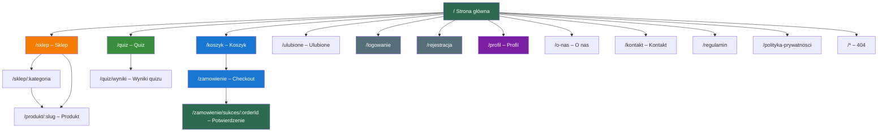

# 🍵 TeaShop – Architektura Informacji (Version 2 – stan implementacji)

> [!info] O dokumencie
> Wersja 2 architektury informacji, **zweryfikowana z kodem projektu** (`C:\Users\Bartosz\RiderProjects\teashop`, stan: czerwiec 2026).
> W odróżnieniu od [[TeaShop_architektura_informacji_Version1]] (wizja projektowa), ten dokument opisuje **faktycznie zaimplementowaną** strukturę aplikacji.
> Powiązane notatki: [[TeaShop_diagram_funkcjonalnosci_Version1]] · [[TeaShop_slownik_funkcji_Version1]] · [[TeaShop_schemat_powiazan_Version1]] · [[TeaShop_mapa_pojec]]

---

## 1. Mapa strony (sitemap) – trasy z `web/src/app/router.tsx`



> [!note] Różnice względem Version 1
> - Strona produktu ma trasę **`/produkt/:slug`** (nie `/sklep/:slug`) – trasa jest płaska, nie zagnieżdżona w kategorii.
> - Doszła trasa **`/zamowienie/sukces/:orderId`** (potwierdzenie zamówienia).
> - **Brak `/blog`** – blog pozostaje w zakresie v2 i nie został zaimplementowany.

---

## 2. Hierarchia nawigacji (z `Header.tsx` / `Footer.tsx`)

### 2.1 Header (sticky, wszystkie strony)

```
┌──────────────────────────────────────────────────────────────┐
│  🍵 TeaShop   Sklep ▾   Quiz   O nas   Kontakt   🔍 ♥ 👤 🛒 │
│                ├─ Czarna                                     │
│                ├─ Zielona                                    │
│                ├─ Biała                                      │
│                ├─ Oolong                                     │
│                ├─ Pu-erh                                     │
│                ├─ Matcha                                     │
│                ├─ Ziołowa                                    │
│                ├─ Blendy                                     │
│                └─ Wszystkie →                                │
└──────────────────────────────────────────────────────────────┘
```

- 🔍 otwiera **SearchOverlay** (wyszukiwarka pełnoekranowa)
- ♥ prowadzi do `/ulubione`, 👤 do `/profil`
- 🛒 otwiera **CartDrawer** (podgląd koszyka w panelu bocznym) – nie jest to link do `/koszyk`
- Badge na koszyku pokazuje liczbę produktów (stan z Zustand)
- Na mobile nawigację zastępuje hamburger → **MobileMenu**

### 2.2 Footer

```
┌──────────────────────────────────────────────────────────────┐
│  🍵 TeaShop — „Herbata dopasowana do Twojego nastroju"       │
│                                                              │
│  Sklep              Pomoc                Firma               │
│  ├─ Wszystkie       ├─ Kontakt           ├─ O nas            │
│  ├─ Bestsellery     ├─ Dostawa i zwroty  ├─ Quiz nastroju    │
│  └─ Nowości         └─ Regulamin         └─ Polityka pryw.   │
│                                                              │
│  © 2026 TeaShop  |  BLIK · Visa · MC · InPost · DPD · Poczta │
└──────────────────────────────────────────────────────────────┘
```

> [!note] Różnica względem Version 1: brak kolumny Social (Instagram/Facebook/TikTok) oraz pozycji FAQ i Praca.

---

## 3. Taksonomia treści (z `categoryMeta.ts`, `moodMeta.ts`, `data.ts`)

### 3.1 Kategorie produktów (8)

| Slug | Nazwa | Ikona (lucide) |
|---|---|---|
| `czarna` | Czarna | Coffee |
| `zielona` | Zielona | Leaf |
| `biala` | Biała | Flower |
| `oolong` | Oolong | Wind |
| `puerh` | Pu-erh | Layers |
| `matcha` | Matcha | Sprout |
| `ziolowa` | Ziołowa | Flower2 |
| `blendy` | Blendy | Blend |

### 3.2 Tagi nastroju (6) – z wagami 0.0–1.0 na produktach

| Slug | Nazwa | Ikona | Token koloru |
|---|---|---|---|
| `relaks` | Relaks | Waves | `--color-mint` |
| `energia` | Energia | Zap | `--color-gold` |
| `fokus` | Fokus | Target | `--color-brand-green-mid` |
| `comfort` | Comfort | Heart | `--color-rating` |
| `wieczor` | Wieczór | Moon | `--color-brand-dark` |
| `detox` | Detox | Droplets | `--color-sage-50` |

### 3.3 Tagi smakowe (10)

`kwiatowa` · `owocowa` · `orzechowa` · `ziemista` · `trawiasta` · `przyprawowa` · `umami` · `słodowa` · `słodka` · `gorzka`

### 3.4 Pozostałe wymiary klasyfikacji

| Wymiar | Wartości |
|---|---|
| Kofeina | poziomy filtrowane w sklepie (parametr `caffeine`) |
| Sortowanie | `popularnosc` (domyślne) · `cena-asc` · `cena-desc` · `nowosci` · `ocena` |
| Dostawa | Paczkomat InPost 9,99 zł · Poczta Polska 12,99 zł · Kurier DPD 14,99 zł |
| Darmowa dostawa | od **99 zł** (`FREE_SHIPPING_THRESHOLD`) |
| Kody rabatowe | `HERBATA10` (-10%) · `RELAKS20` (-20 zł) · `WIOSNA` (-15%) |

---

## 4. Struktura quizu nastrojowego (z `mocks/data.ts`, `quiz/scoring.ts`)

Quiz ma **7 pytań kafelkowych** (jedna odpowiedź na pytanie, kafelki z ikonami):

| # | ID | Pytanie | Typ | Mapowane tagi |
|---|---|---|---|---|
| 1 | `q1` | Jak się dziś czujesz? | nastrój | relaks / energia / fokus / comfort |
| 2 | `q2` | Pora dnia | nastrój | energia / fokus / relaks / wieczór |
| 3 | `q3` | Czego potrzebujesz? | nastrój | relaks / energia / fokus / comfort |
| 4 | `q4` | Preferencje smakowe | preferencje | kwiatowe / owocowe / ziołowe / słodkie |
| 5 | `q5` | Moc herbaty | preferencje | delikatna / średnia / mocna |
| 6 | `q6` | Tolerancja kofeiny | preferencje | energia / fokus / wieczór / detox |
| 7 | `q7` | Cel | cel | Dopasuj / Popraw / Zaskocz |

Przepływ: odpowiedzi → `rankProducts()` (scoring ważony tagami) → **Top rekomendacje z % dopasowania** → przy zbyt niskim wyniku **fallback na bestsellery** (`isFallback`). Wynik zapisywany lokalnie (store quizu + localStorage).

---

## 5. Warstwa danych – kontrakt API (mock, `mocks/server.ts`)

Frontend działa standalone na **mocku in-browser**, który odwzorowuje kontrakt planowanego API .NET (projekt `api/TeaShop.Api` jest na razie szkieletem – sam `Program.cs`).

| Metoda i ścieżka | Opis |
|---|---|
| `GET /health` | Status mocka |
| `GET /categories` · `/mood-tags` · `/flavor-tags` | Słowniki taksonomii |
| `GET /delivery-options` · `/config` | Dostawy, próg darmowej wysyłki |
| `GET /products?category&mood&flavor&caffeine&minPrice&maxPrice&minRating&q&sort&page` | Listing z filtrami (9 / stronę) |
| `GET /products/:slug` · `/related` · `/reviews` | Produkt, cross-sell, recenzje |
| `GET /quiz/questions` · `POST /quiz/submit` | Quiz → `QuizResult` z rekomendacjami |
| `GET /coupons/:code` | Walidacja kodu rabatowego |
| `POST /orders` · `GET /orders/:id` | Złożenie i podgląd zamówienia |
| `POST /auth/login` · `/auth/register` · `GET /auth/me` | Auth (token mock, hasło `password`) |

Każde żądanie ma symulowane opóźnienie **150–400 ms**; parametr `?_fail=1` wymusza błąd 500 (testowanie stanów błędów).

### 5.1 Stan po stronie klienta

| Stan | Mechanizm |
|---|---|
| Koszyk | Zustand store (`cart/store.ts`) + drawer (`uiStore.ts`) – **nie ma endpointu `/cart`**, koszyk żyje w przeglądarce |
| Ulubione | Zustand store (`favorites/store.ts`) – produkty dociągane przez `GET /products?ids=` |
| Quiz (szkic + wynik) | Zustand store (`quiz/store.ts`) |
| Sesja użytkownika | Zustand store (`auth/store.ts`) + token |
| Toasty | Kolejka w `toast/store.ts` |
| Dane serwerowe | TanStack Query (hooki w `features/*/api.ts`) |

---

## 6. Status implementacji względem specyfikacji (Version 1)

| Element specyfikacji | Status | Uwagi |
|---|---|---|
| Strona główna, sklep, produkt, quiz, koszyk, checkout | ✅ | Pełny przepływ zakupowy z guest checkout |
| Drawer koszyka, kody rabatowe, darmowa dostawa od 99 zł | ✅ | |
| Quiz 7 pytań + scoring + fallback | ✅ | 3 × nastrój, 3 × preferencje, 1 × cel |
| Ulubione, profil, logowanie/rejestracja | ✅ | Auth mockowy |
| Strony statyczne (O nas, Kontakt, Regulamin, Prywatność, 404) | ✅ | |
| Wyszukiwarka (overlay) | ✅ | Szuka po nazwie, pochodzeniu, kategorii, tagach |
| Blog / Poradnik | ❌ (v2) | Brak trasy i strony |
| Zestawy podarunkowe | ❌ (v2) | Brak danych i endpointu `giftSets` |
| Porzucony koszyk (e-mail) | ❌ (v2) | |
| Backend .NET z seedowaniem | 🔶 w budowie | Katalogi `Endpoints/`, `Domain/` itd. puste – działa mock in-browser |
| Płatności (BLIK/karta/Pay) | 🔶 symulacja | Zamówienie od razu dostaje status `paid` |

Legenda: ✅ zaimplementowane · 🔶 częściowo / symulowane · ❌ niezaimplementowane (zakres v2)
