# 🍵 TeaShop – Diagram Funkcjonalności

```mermaid
flowchart TB
    subgraph APP["🍵 TeaShop"]

        subgraph HEADER["🔝 Header (sticky, każda strona)"]
            Logo["Logo"]
            Nav["Nawigacja: Sklep | Quiz | O nas | Blog"]
            Search["🔍 Wyszukiwarka"]
            Profile["👤 Profil"]
            Cart["🛒 Koszyk + Badge"]
        end

        subgraph HOME["🏠 Strona Główna"]
            Hero["Hero + CTA Quiz / Sklep"]
            Categories["Kafelki kategorii herbat"]
            Bestsellers["Karuzela bestsellerów"]
            QuizCTA["Sekcja zachęty do quizu"]
            NewProducts["Nowości"]
            SocialProof["Social proof / opinie"]
            Newsletter["Newsletter signup"]
        end

        subgraph QUIZ["🧠 Quiz Nastrojowy"]
            Q_Start["Start quizu (bez logowania)"]
            Q_Mood["3–4 pytania o nastrój"]
            Q_Flavor["2–3 pytania o preferencje smakowe"]
            Q_Goal["1 pytanie: Dopasuj / Popraw / Zaskocz"]
            Q_Algorithm["Algorytm scoringowy\n(ważone tagi)"]
            Q_Results["Wyniki: Top 3–5 herbat"]
            Q_Fallback["Fallback → Bestsellery"]
            Q_Save["Zapis wyniku\n(localStorage / baza)"]
            Q_Filter["Filtr post-quizowy\n(zawęź rodzaj herbaty)"]

            Q_Start --> Q_Mood --> Q_Flavor --> Q_Goal
            Q_Goal --> Q_Algorithm
            Q_Algorithm -->|score > próg| Q_Results
            Q_Algorithm -->|score < próg| Q_Fallback
            Q_Results --> Q_Filter
            Q_Results --> Q_Save
        end

        subgraph SHOP["🛍️ Sklep"]
            Listing["Lista produktów (grid)"]
            Filters["Filtry: Rodzaj | Nastrój | Smak\nCena | Kofeina | Ocena"]
            Sorting["Sortowanie: Popularność | Cena\nNowości | Ocena"]
            ProductCard["Karta produktu w listingu\n📸 Zdjęcie | Mood badge\nNazwa | Cena | Rating\n🛒 Quick Add"]
            ProductPage["Strona produktu"]
            PP_Gallery["Galeria zdjęć"]
            PP_Brewing["☕ Sekcja parzenia\n(temp / czas / ilość)"]
            PP_Tags["Mood & Flavor tagi"]
            PP_Reviews["⭐ Recenzje"]
            PP_CrossSell["Sekcja 'Pasuje do'"]
            PP_Fav["♥ Dodaj do ulubionych"]
            PP_AddCart["🛒 Dodaj do koszyka\n(sticky na mobile)"]

            Listing --> ProductCard
            Filters --> Listing
            Sorting --> Listing
            ProductCard --> ProductPage
            ProductPage --- PP_Gallery
            ProductPage --- PP_Brewing
            ProductPage --- PP_Tags
            ProductPage --- PP_Reviews
            ProductPage --- PP_CrossSell
            ProductPage --- PP_Fav
            ProductPage --- PP_AddCart
        end

        subgraph CART_CHECKOUT["🛒 Koszyk & Checkout"]
            CartDrawer["Podgląd koszyka (drawer)"]
            CartPage["Pełna strona koszyka\nEdycja ilości | Usuwanie"]
            Coupon["Kod rabatowy"]
            FreeShip["Darmowa dostawa od 99 zł"]
            Checkout["Checkout (3 kroki)"]
            CH_Address["1️⃣ Dane dostawy"]
            CH_Delivery["2️⃣ Wybór dostawy\nInPost | Kurier | Poczta"]
            CH_Summary["3️⃣ Podsumowanie"]
            CH_Payment["Płatność\nBLIK | Karta | P24\nApple Pay | Google Pay"]
            CH_Guest["Guest checkout ✓"]
            CH_Success["✅ Zamówienie złożone"]
            AbandonedCart["Porzucony koszyk\n(toast / e-mail 24h / rabat 72h)"]

            CartDrawer --> CartPage
            CartPage --> Coupon
            CartPage --> FreeShip
            CartPage --> Checkout
            Checkout --> CH_Address --> CH_Delivery --> CH_Summary --> CH_Payment --> CH_Success
            CH_Guest -.-> Checkout
            CartPage -.-> AbandonedCart
        end

        subgraph USER["👤 Użytkownik"]
            Auth["Logowanie / Rejestracja\n(email + hasło | OAuth v2)"]
            ProfilePage["Profil"]
            Orders["Historia zamówień"]
            Favorites["❤️ Ulubione"]
            QuizHistory["Historia quizów\n+ CTA powtórz quiz"]
            GuestData["Gość: localStorage\n(cart, favorites, quizResult)"]
            Migration["Migracja danych\nprzy rejestracji"]

            Auth --> ProfilePage
            ProfilePage --- Orders
            ProfilePage --- Favorites
            ProfilePage --- QuizHistory
            GuestData -.->|rejestracja| Migration --> ProfilePage
        end

        subgraph NOTIFICATIONS["🔔 Toast System"]
            T_Success["✅ success\n(dodano do koszyka / ulubionych)"]
            T_Error["❌ error\n(błąd płatności)"]
            T_Info["ℹ️ info\n(porzucony koszyk / quiz zapisany)"]
            T_Rules["Auto-dismiss 4s\nMax 1 na raz | Kolejkowanie"]
        end

        subgraph STATIC["📄 Strony statyczne"]
            About["O nas\n(historia, misja, wartości)"]
            Terms["Regulamin"]
            Privacy["Polityka prywatności"]
            Contact["Kontakt (formularz)"]
            Blog["Blog / Poradnik parzenia (v2)"]
            Page404["404 z CTA"]
        end

        subgraph DATA["🏗️ Architektura danych"]
            DB["Baza danych\n(PostgreSQL / MongoDB)"]
            JSONServer["JSON Server (dev)\n/products | /giftSets"]
            LocalStorage["localStorage\ncart | favorites\nquizResult | savedAddress"]
            CDN["CDN – zdjęcia\n(Cloudinary / S3)"]
            Admin["Panel admina\nCRUD produktów\nBestsellery override"]
        end

    end

    %% Connections between subgraphs
    Hero -->|CTA| Q_Start
    QuizCTA -->|CTA| Q_Start
    Q_Results --> ProductPage
    Q_Filter --> Listing
    Search --> Listing
    PP_AddCart --> CartDrawer
    Categories --> Listing
    Bestsellers --> ProductPage

    style APP fill:#fefefe,stroke:#2d6a4f,stroke-width:2px
    style QUIZ fill:#e8f5e9,stroke:#388e3c
    style SHOP fill:#fff3e0,stroke:#f57c00
    style CART_CHECKOUT fill:#e3f2fd,stroke:#1976d2
    style USER fill:#f3e5f5,stroke:#7b1fa2
    style NOTIFICATIONS fill:#fff8e1,stroke:#fbc02d
    style HEADER fill:#eceff1,stroke:#546e7a
    style HOME fill:#fce4ec,stroke:#c62828
    style STATIC fill:#efebe9,stroke:#795548
    style DATA fill:#e0f2f1,stroke:#00796b
```

---

## 📋 Legenda modułów

| Moduł | Funkcje kluczowe | Priorytet |
|---|---|---|
| 🔝 Header | Nawigacja, wyszukiwarka, koszyk, profil | MVP |
| 🏠 Strona główna | Hero, CTA quiz, bestsellery, kategorie | MVP |
| 🧠 Quiz | 6–8 pytań, scoring, fallback, zapis | MVP |
| 🛍️ Sklep | Listing, filtry, sortowanie, karty produktów | MVP |
| 📦 Produkt | Galeria, parzenie, tagi, recenzje, cross-sell | MVP |
| 🛒 Koszyk | Drawer, strona, kody rabatowe, darmowa dostawa | MVP |
| 💳 Checkout | 3 kroki, guest checkout, płatności | MVP |
| 👤 Użytkownik | Auth, profil, zamówienia, ulubione, historia quizów | MVP / v2 |
| 🔔 Toasty | Success, error, info – auto-dismiss 4s | MVP |
| 📄 Statyczne | O nas, regulamin, kontakt, blog (v2) | MVP / v2 |
| 🏗️ Dane | DB, localStorage, CDN, admin panel | MVP |