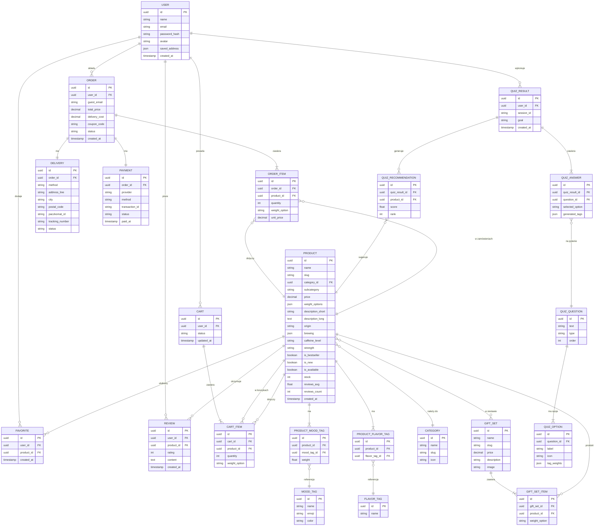
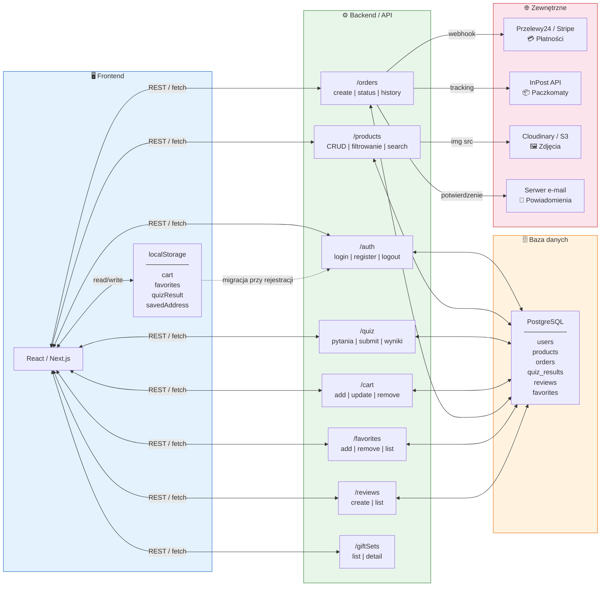

# 🍵 TeaShop – Schemat Powiązań

---

## 🔗 Schemat przepływu danych

---

## 🔄 Kluczowe powiązania – podsumowanie

| Relacja | Typ | Opis |
|---|---|---|
| User → Cart | 1:1 | Każdy user ma jeden aktywny koszyk |
| User → Order | 1:N | User może mieć wiele zamówień |
| User → Quiz Result | 1:N | User może robić quiz wielokrotnie |
| User → Favorite | 1:N | Wiele ulubionych produktów |
| User → Review | 1:N | Wiele recenzji |
| Product → Mood Tag | N:M | Produkt ma wiele tagów z wagami |
| Product → Flavor Tag | N:M | Produkt ma wiele tagów smakowych |
| Product → Category | N:1 | Produkt należy do jednej kategorii |
| Product → Gift Set | N:M | Produkt może być w wielu zestawach |
| Quiz Result → Quiz Answer | 1:N | Wynik zawiera odpowiedzi na pytania |
| Quiz Option → Product | pośrednia | Opcja generuje tagi → scoring → rekomendacja produktu |
| Order → Delivery | 1:1 | Jedno zamówienie = jedna dostawa |
| Order → Payment | 1:1 | Jedno zamówienie = jedna płatność |
| localStorage → User | migracja | Dane gościa migrują do konta przy rejestracji |